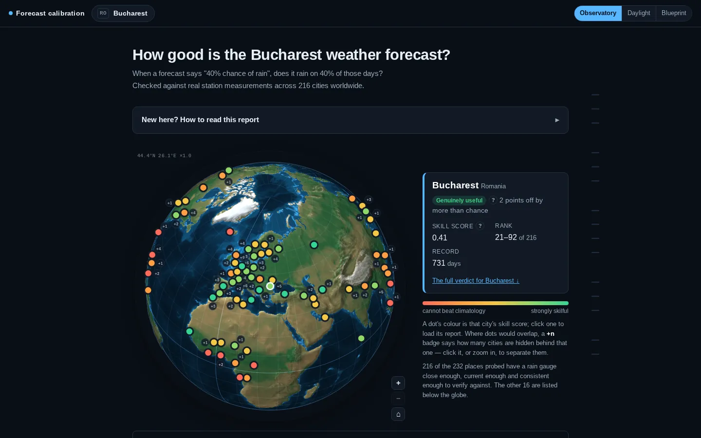

<div align="center">


# rain-check

### Is "40% chance of rain" a promise you can bank on?

An open, reproducible audit of the rain probabilities weather apps show you.<br>
Years of served forecasts, lined up day by day against what real rain gauges measured,<br>
across **216 cities** worldwide. Every number is rebuilt by one script,<br>
and every claim is reported with the interval that says how far to trust it.

<a href="https://github.com/bogdanr/rain-check/actions/workflows/pages.yml"></a>


<a href="NOTICE.md"></a>


<a href="https://bogdan.nimblex.net/rain-check/"><b>Read the report</b></a> ·
<a href="#what-it-found">Findings</a> ·
<a href="#how-it-works">Method</a> ·
<a href="#reproduce-it">Reproduce</a> ·
<a href="NOTICE.md">Data &amp; licences</a>

<a href="https://bogdan.nimblex.net/rain-check/">
<picture>
  <source media="(prefers-color-scheme: light)" srcset=".github/readme/daylight.webp">
  
</picture>
</a>

</div>

A weather app's "40%" makes a claim you can check: across all the days it says 40%, it should rain on about 4 in 10. Almost nobody checks this in public, per city, against real gauges. rain-check does. Pick a city on the globe to get a plain-language verdict, its calibration curve, its rank *range* (rankings with a clear winner are usually noise), and the machinery behind each number, one click deeper.

> **Live report: <https://bogdan.nimblex.net/rain-check/>**
> Three themes (Observatory, Daylight, Blueprint), a page per city, and a searchable glossary. No tracking.

## Sixty seconds

Two numbers carry most of the report:

| Number | Question it answers | How to read it |
|--------|---------------------|----------------|
| **Calibration** | When it said 40%, did it rain 40% of the time? | On the chart, the dashed diagonal is a perfectly honest forecast. A green band shows where a *flawless* forecast would still land given the sample size. |
| **Skill score** (Brier Skill Score) | Is it any better than always quoting the local average? | `0` = no better, `1` = perfect, below `0` = worse. Day-ahead rain forecasts usually score 0.3–0.5. |

```
forecast archive ▸ served rain probability ─┐
                                            ├▸ joined per city-day ▸ calibration · skill · decision value ▸ report
rain gauge (GHCN, GHCNh, JMA) ▸ "did it rain?" ─┘     (with day-convention fixes, block-bootstrap intervals)
```

Bucharest, where the study started: **skill 0.41** over 731 days (2024-04-26 → 2026-05-30), ranked 51 of 216 with a rank range of **21–92**. When it says 99%, expect about 82%. When it says 0%, it still rains about 5% of the time.

## What it found

All figures are from the current 216-city edition. The report gives each one with its interval and its caveats.

- 🌂 **Forecasts understate low chances and overstate high ones, almost everywhere.** In the median city, days forecast at ~1% rain 5% of the time, and days forecast at ~96% deliver only 77%. The low end rains more than stated in **166 of 216** cities (135 significant), and the high end rains less than stated in **203 of 216** (185 significant). That is the *opposite* of the consumer "wet bias" reported in the literature (Bickel & Kim, 2008), and it persists outside ICON-EU's domain, so it isn't a quirk of one European model.
- ⚖️ **The metric decides whether you see the harm.** Compared with a probability rebuilt from NOAA's 31-member ensemble on **108,163 city-days in 195 cities**, the served number runs about 9 points drier. On average accuracy it wins. For someone whose precaution is cheap (bringing the washing in, carrying an umbrella), it is *worse than useless*: relative value **−0.28** against the raw ensemble's **+0.04** at a 1:20 cost-loss ratio (p = 0.001).
- 🔁 **"Better calibrated" depends on how you define a rainy day.** Score against a day total over 0.2 mm and the served number is ahead. Score against rain at any point in the day, which is the event it actually answers, and the verdict reverses. Both directions resolve at p = 0.001. No calibration verdict here is quoted without its event definition.
- 🪪 **Two names, one forecast.** MET Norway serves ECMWF IFS's rain probability digit for digit: **20,760 hours, 19 cities, 100% identical**. Its rainfall amounts differ. Duplicates are merged before any ranking, so one forecast never takes two places in the league table.
- 🧭 **Your app may silently pick the model.** Open-Meteo's default `best_match` sends each European capital to either ICON-EU or ECMWF IFS without saying so. At Bucharest that choice alone is worth +0.10 skill. The ranking was rebuilt with each model pinned everywhere and it held: the ordering reflects geography, not routing.
- 📉 **A tidy result that didn't replicate, reported anyway.** Across 15 capitals, skill seemed to be set by how often it rains (r = −0.77). At 216 cities that relationship almost disappears (r = −0.20). The capitals-only version would have been published as a finding.
- 🌡️ **Temperature, for scale.** The median city's daily-max error is **1.1 °C** one day ahead and **2.15 °C** at seven, in line with published benchmarks. Rainfall *amounts* score worse than a same-day-of-year climatology, even where the rain/no-rain call is good.

## How it works

rain-check has no model of its own. It collects forecasts as they were served, collects what fell, and makes the comparison hard to fool.

- **Truth from gauges, not models.** Primary truth is GHCN-Daily. GHCNh and JMA's own observatory records reach countries GHCN cannot. NOAA ISD enters only as a provisional source and is kept out of every pooled claim. ERA5 reanalysis is a cross-check only: grading a model against a model flatters it (Bucharest skill 0.41 → 0.52).
- **A mechanical city filter.** A city needs a gauge within 25 km and within 300 m of the grid point's elevation that reports through the whole window. Of 232 places probed, 216 pass. The 16 that fail are listed on the site with the reason, not dropped quietly.
- **The day convention is measured, not assumed.** A gauge read at 07:00 mostly reports yesterday's rain. Each city's shift is estimated against reanalysis and kept only if it wins in ≥ 90% of block-bootstrap resamples. One day of mis-dating costs about 0.09 Brier, which is larger than most effects in the study.
- **Intervals that respect the weather.** Rain persists for days and neighbouring cities share weather systems. The block bootstrap therefore resamples days with all their cities, and countries for spatial claims. The naive independent-sample interval covers only about a third of the time at a nominal 95%, and the test suite shows it.
- **Checks that can fail.** All 27 stages of `run_all.sh` run self-tests that **abort the pipeline**. Each check is shown to fire on a planted effect and to stay silent when nothing is planted.
- **Negative results are findings.** Four open questions closed in the negative: verification isn't currently possible across most of Africa and South America, gauge error undermines the Brier claim but not the decision claim, no city property predicts skill, and no affordable sample settles the headline Brier difference. Each is published with the bound that gives it meaning.

## Reproduce it

**Rebuild the report from committed artefacts** (a few minutes, no study data downloaded). This is exactly what CI does:

```sh
python3.12 -m venv .venv && . .venv/bin/activate
pip install -r requirements-site.txt
python -m playwright install chromium   # once, for the site checks
python src/report.py            # renders dist/ from data/processed/*.parquet + figures/
python src/check_site.py        # drives a real browser over the built site
```

**Re-run the whole study** (days of archive downloads the first time, then cached):

```sh
pip install -r requirements-site.txt -r requirements-ensemble.txt requests scipy
./run_all.sh                    # 27 stages; steps whose outputs are fresh are skipped
SKIP_UNCHANGED=0 ./run_all.sh   # force a full rebuild
```

Network responses are cached under `data/cache/`, so a warm run makes no network requests at all. `requirements-ensemble.txt` is needed only to re-collect the ensemble archives (dynamical.org Zarr/Icechunk, NOAA GRIB2, CHIRPS rasters). Their outputs are committed, so you don't need it to reproduce the published numbers.

**Publishing.** [`.github/workflows/pages.yml`](.github/workflows/pages.yml) never re-runs the analysis. It rebuilds the page around the committed tables and figures, verifies it in Chromium, and deploys to GitHub Pages. A copy or CSS change therefore can't move a published statistic. Re-running the study is a deliberate local step, reviewed as a diff.

## Repository layout

| Path | What's there |
|------|--------------|
| `run_all.sh` | The whole study, end to end, in 27 stages |
| `src/` | Collection, truth sources, scoring, significance, report rendering (`report.py`), site checks (`check_site.py`) |
| `src/web/` | Front-end for the report: globe, themes, charts (d3-geo / d3-array vendored) |
| `data/processed/` | Committed analysis tables (Parquet/JSON) that the page is built from |
| `figures/` | Committed static figures |
| `dist/` | The built site (`python src/atlas.py`); not committed, the Pages workflow builds its own |
| `design/` | Design prototypes and screenshot tooling for the site redesign |

## Data and licences

Forecasts: **Weather data by [Open-Meteo.com](https://open-meteo.com/)** (CC BY 4.0), backed by ECMWF, DWD, NOAA, Météo-France, the Met Office, ECCC, JMA, MET Norway, KNMI, DMI, ARPAE and MeteoSwiss. Ensembles come via [dynamical.org](https://dynamical.org/). Truth comes from NOAA GHCN-Daily (Menne et al. 2012), GHCNh and ISD, and the Japan Meteorological Agency. Satellite rainfall is CHIRPS, city locations are GeoNames, and income groups are from the World Bank.

Everything in `data/` and `dist/` is offered under **CC BY 4.0**, except seven files derived from UK Met Office output. Those inherit **CC BY-SA 4.0**, and no headline table carries a Met Office series. The build fails if that ever changes. The full record, with each licence's wording, URL and the date it was read, is in [NOTICE.md](NOTICE.md) (generated by `src/provenance.py`).

## Status

This is an active research project, heading toward a preprint and a Zenodo archive. The report is the working edition and changes as new checks land. Known weaknesses are listed on the site under *How this analysis could be improved*. Corrections are very welcome, especially ones that break a claim.

## Contact

Built by [Bogdan Radulescu](https://bogdan.nimblex.net/). The rig behind this report (collect, reconcile, score, publish) also works for SLOs, vendor accuracy claims and production models. Get in touch at [bogdan@nimblex.org](mailto:bogdan@nimblex.org) or open an issue.
